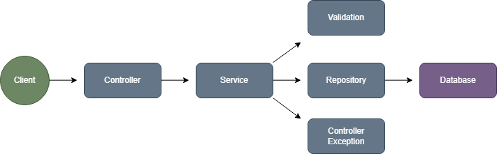
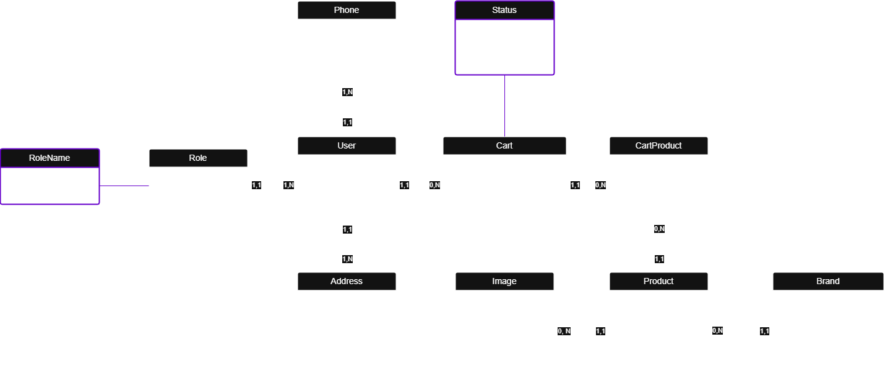

<h1 align="center"><b>BLACKTECH</b></h1>

### 🎯 **OBJETIVO**

> **BlackTech** é uma aplicação web composta por uma **API RESTful**, desenvolvida em **Java** com **Spring Boot**, e uma interface de usuário construída com **HTML, CSS e JavaScript**.

> O projeto tem como objetivo oferecer uma plataforma completa de **e-commerce**, incluindo funcionalidades como **cadastro de produtos, gestão de usuários, processamento de pedidos, autenticação e controle do fluxo de compras.**

> Seguindo as boas práticas de desenvolvimento limpo **(Clean Code)**, o sistema foi projetado com foco em escalabilidade e manutenibilidade, utilizando **Spring Data JPA** para garantir uma persistência de dados eficiente e confiável.


#
### 🔧 **FUNCIONALIDADES**

- 🔐 **Autenticação com JWT:**
Implementação de autenticação segura via JSON Web Token (JWT), garantindo a integridade das comunicações e o controle de acesso a rotas protegidas com Spring Security.

- 🧪 **Validação e Tratamento de Exceções Personalizado:**
Sistema robusto de tratamento de erros e validação, utilizando @Valid e @ExceptionHandler, com respostas padronizadas e amigáveis ao usuário final.

- 🔁 **Transações com Callback:**
Gerenciamento de transações com execução controlada de callbacks para assegurar a integridade e consistência em operações críticas como pagamentos e atualizações de estoque.

- 📦 **Data Transfer Objects (DTOs):**
Utilização de DTOs para normalização e padronização dos dados entre as camadas da aplicação, promovendo segurança e separação de responsabilidades.

- 📚 **Documentação Interativa com Swagger UI:**
Integração do Swagger UI para documentação automática e interativa da API, facilitando a exploração dos endpoints por desenvolvedores.

- 🔄 **Controle de Tentativas em Requisições Externas:**
Estruturação de tentativas automáticas controladas (Retry) em integrações externas, como serviços de pagamento e transporte, para manter a estabilidade e a disponibilidade do sistema.

- 🛍 **Cadastro e Gerenciamento de Produtos:**
Cadastro, edição e remoção de produtos com atributos como nome, descrição, preço e estoque.

- 👤 **Gestão de Usuários:**
Registro, autenticação e gerenciamento de contas de usuários, com perfis distintos (cliente e administrador).

- 🛒 **Carrinho de Compras:**
Funcionalidade para adicionar, remover e visualizar itens no carrinho, com controle dinâmico de quantidade e preço total.

- 📦 **Processamento de Pedidos:**
Finalização de compras, geração de pedidos, vínculo com o usuário e atualização automática do estoque.

- 📄 **Histórico de Pedidos por Usuário:**
Consulta de pedidos realizados por usuário, com detalhes como data, produtos adquiridos e status da compra.

- 🛠 **Área Administrativa:**
Endpoints restritos para administradores, com controle total sobre produtos e pedidos.

- 💾 **Persistência de Dados com Spring Data JPA:**
Armazenamento e manipulação de dados em banco relacional (PostgreSQL) com repositórios JPA, garantindo integração eficiente com a camada de persistência.

- ✅ **Testes Automatizados com JUnit:**
Cobertura de testes unitários para os principais serviços e endpoints, assegurando a confiabilidade da aplicação e facilitando manutenções futuras.


#
### 🔄 **REPRESENTAÇÃO DE FLUXO**

> A representação de fluxo visa graficamente ilustrar o comportamento da aplicação em nível arquitetural, destacando os principais recursos empregados para assegurar o funcionamento eficiente do serviço.

- **Arquitetura**

<div align="center">
  
</div>


#
### 🧩 MODELAGEM DE PERSISTÊNCIA

> Este diagrama ilustra a estrutura das entidades e seus relacionamentos no banco de dados, fornecendo uma visão clara e útil para o desenvolvimento e manutenção da aplicação.

<div align="center">
  
</div>


#
### 📌 **REQUISITOS**

Para executar nossa plataforma localmente, é necessário ter em seu dispositivo computacional:

  1. Certifique-se que instalou a versão **21 do Java**.  [Baixe aqui](https://www.oracle.com/java/technologies/javase/jdk21-archive-downloads.html)

  2. Certifique-se de que tenha instalado alguma **IDE** em sua máquina. [Baixe aqui](https://www.jetbrains.com/idea/download/?section=windows)

  3. Certifique-se de que tenha o **PostgreSQL** instalado. [Baixe aqui](https://www.postgresql.org/download/)


#
### ⬇️ **DOWNLOAD DO PROJETO**

Baixe o projeto em seu computador através do comando:

```bash
git clone https://github.com/Kauan-Ts16/BlackTech.git
```

**ou**

1. Clique em `<> Code`.
2. Faça o download do arquivo ZIP.
3. Abra o seu explorador de arquivos na localização da instalação.
4. Extraia o arquivo ZIP.


#
### ▶️ **EXECUÇÃO**

Sequência de execução do projeto:

```
1.  Acesse a IDE na qual deseja executar o projeto.
2.  Clique em "Abrir um projeto já existente".
3.  Selecione o local da pasta descompactada do projeto.
4.  Confirme a seleção.
5.  Crie um banco de dados ou utilize um de teste.
6.  Altere o arquivo "application.properties" com o nome do banco e a senha.
7.  Localize e clique no botão "Play" (verde) localizado na parte superior da IDE.
8.  Um terminal integrado será aberto.
9.  Aguarde a instalação das dependências do projeto.
10. Após a conclusão das instalações, o projeto será executado.

AO FINAL DA EXECUÇÃO, VOCÊ PODERÁ TESTAR A APLICAÇÃO LOCALMENTE NO NAVEGADOR USANDO O DOMÍNIO ABAIXO.

```


#
### 💻 **TECNOLOGIAS**

#### 🔙 Backend

&nbsp;
&nbsp;
&nbsp;
&nbsp;
&nbsp;
&nbsp;

#### 🌐 Frontend

&nbsp;
&nbsp;
&nbsp;

#### 🛢 Banco de Dados

&nbsp;

#### 📘 Documentação

&nbsp;


#
### 🌐 DOMÍNIO DA API

```
http://localhost:8080
```


#
### 📚 DOCUMENTAÇAO DA API

```
http://localhost:8080/swagger-ui/index.html
```